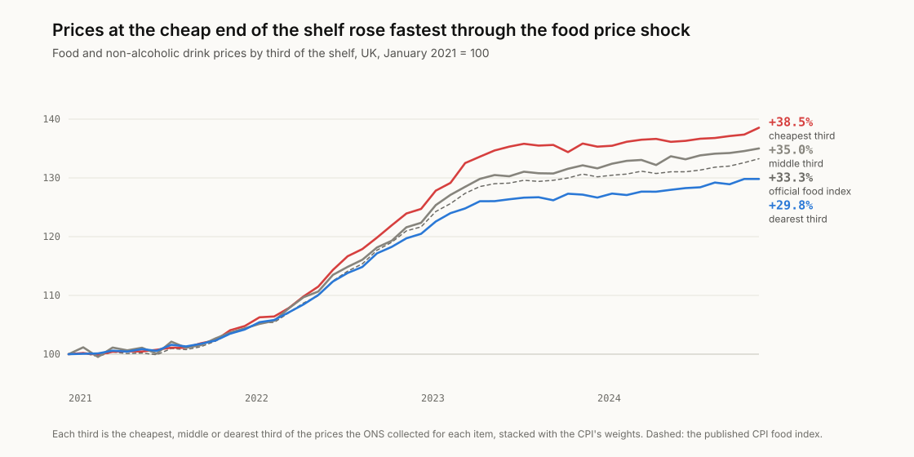
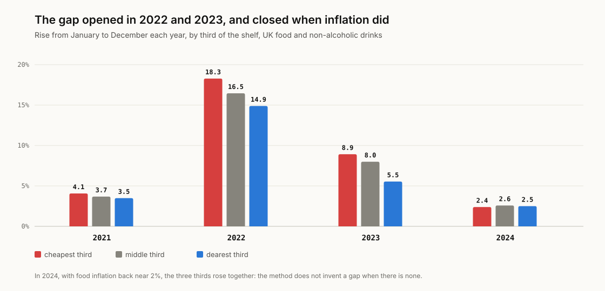
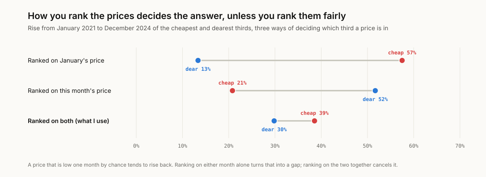
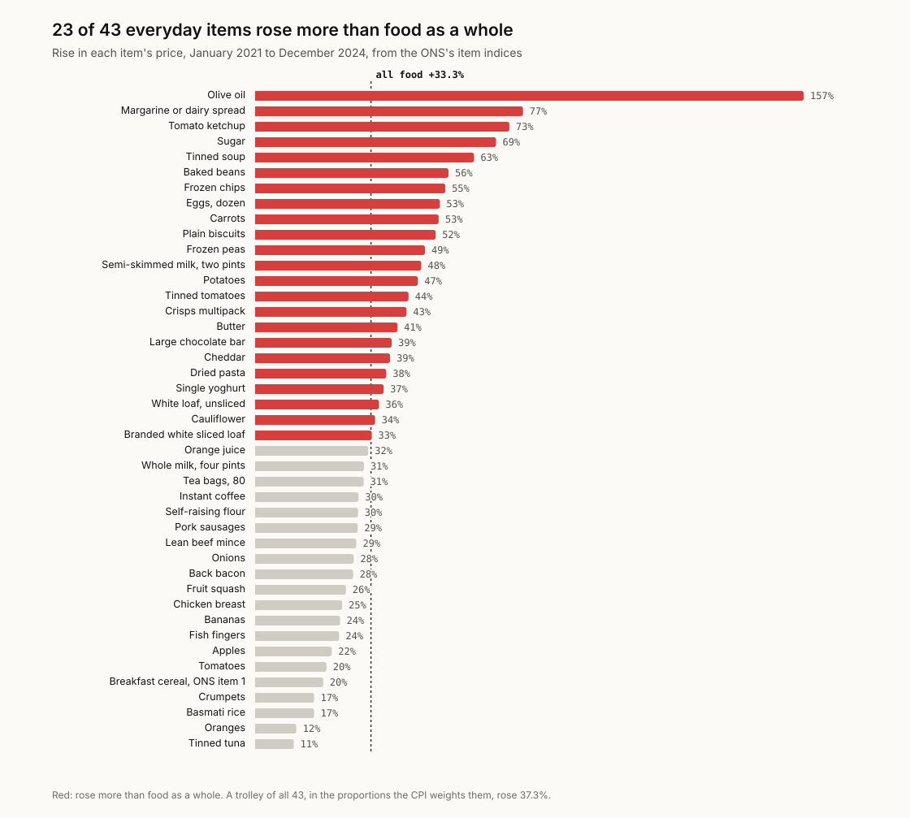

# trolley-watch

Whose food inflation? I rebuilt the ONS's food price index from the 2.2
million prices its collectors wrote down between 2021 and 2024, then split
every item's prices into the cheapest, middle and dearest third of the shelf
and followed each third through the food price shock.

**Check your own trolley:** [finntech3.github.io/trolley-watch](https://finntech3.github.io/trolley-watch/)

## The finding

**Prices at the cheap end of the shelf rose fastest.** From January 2021 to
December 2024 the official food index rose 33.3%. The cheapest third of the
prices collected for each item rose 38.5%, the middle third 35.0% and the
dearest third 29.8%.

<picture>
  <source media="(prefers-color-scheme: dark)" srcset="docs/figures/thirds-dark.svg">
  
</picture>

The gap is the shock, not the method. It opened in 2022 and 2023, when food
inflation was at its worst, and in 2024, with food inflation back near 2%, the
three thirds rose together. At the peak, prices at the cheap end were 22.9%
higher than a year before (April 2023); at the dear end, 17.2% (March 2023).

<picture>
  <source media="(prefers-color-scheme: dark)" srcset="docs/figures/years-dark.svg">
  
</picture>

It holds whichever way I cut it. Items sold at one size or by the kilo show
the same gap as items sold in a range of sizes (35.7% against 27.1%, and 42.9%
against 34.0%), so it is not smaller packs. Splitting each item's prices across
the whole country instead of within each region and shop type gives 38.9% and
29.9%.

**What I think this means.** The official figure was right about food as a
whole and wrong about anyone who buys the cheapest version of everything.
"Switch to the budget range" was the standard advice through the shock, and
switching still saved money, but less than it used to: the cheapest third now
costs 6.7% more, relative to the dearest, than it did in January 2021.

This is not a new claim. It was argued loudly in 2022, and the ONS answered it
with an experimental index of the lowest prices of 30 items on supermarket
websites, which found them rising about 17% in the year to September 2022
against 15% for food and drink. Over the same twelve months, from the prices
collected in shops, I get 16.6% for the cheapest third against 14.6% for all
of them. What this adds is every item, the whole shock and the year after, on
a method that first reproduces the official index.

## Verify before you interpret

Before measuring anything new, I rebuilt the ONS's own numbers from its own
files. Each check has a twin that must fail, so a pass means something.

| Check | Result |
|---|---|
| Every food item's published index, February to December 2021 to 2024, rebuilt from its price quotes | all 7,715 item-months within 0.02 of an index point; 4,761 to the published three decimals; worst 0.017 |
| Twin: the same quotes averaged arithmetically | 67 of 7,715 within 0.02: fails |
| Twin: also counting series whose January price was worked out, not collected | 2,683 of 7,715: fails |
| The published CPI food index (D7BU), rebuilt from the item indices and weights | all 47 months within 0.15; worst 0.103 |
| Twin: every item weighted equally | misses by up to 1.3: fails |
| Items numbered 21 are exactly the CPI's food and non-alcoholic drinks | every year, 2021 to 2024 |

The method that passes is the ONS's: within each stratum (a region, a shop
type, or both) the shop-weighted geometric mean of each price over the same
product's January price, and the strata averaged by their weights. A quote
counts if it was validated this month and in January.

The 135 item-months the ONS flagged as imputed during the pandemic are
reported but not gated: their published values were not made from these
quotes alone, and the worst of them is 0.36 away.

## The trap in the obvious method

The obvious way to ask "did cheap food rise faster?" is to sort each quote by
its January price and follow it through the year. For 2021 that says the
cheapest third rose 7.9% and the dearest fell 0.6%. Sort by December's price
instead and it says the opposite: 0.3% and 8.2%. That is regression to the
mean. A price that is low one month by chance, a promotion or an unusual
product, tends to rise back, so "cheap in January" rises fastest whether or
not anything real is going on.

<picture>
  <source media="(prefers-color-scheme: dark)" srcset="docs/figures/trap-dark.svg">
  
</picture>

Over the four years, sorting on January's price would tell you the cheap end
rose 57% and the dear end 13%. So each quote is ranked on the midpoint of its
January price and this month's, which cancels the effect when the chance part
of a price is as big in one month as the other. The tests check that on
made-up prices where the answer is known: with no real gap, ranking on
January invents one of over 6 points and the midpoint finds none; with a real
10-point gap, the midpoint finds about 9, slightly understating it.

## What went up most

<picture>
  <source media="(prefers-color-scheme: dark)" srcset="docs/figures/everyday-dark.svg">
  
</picture>

23 of 43 everyday items rose more than food as a whole, and a trolley of all
43, in the proportions the CPI weights them, rose 37.3%. Several staples of a
tight budget did worse than the average: sugar 69%, baked beans 56%, frozen
chips 55%, eggs 53%, semi-skimmed milk 48%, potatoes 47%.

## How it works

- **The prices.** Every month the ONS publishes each price its collectors
  recorded for the CPI: about 45,000 for food and drink, each with the same
  product's January price and the weights of its shop and stratum. The
  extracts in `data/sources` keep those rows and columns, and `fetch.py`
  rebuilds them from the original files after checking each one's SHA-256.
- **The thirds.** Each month, within each item and each stratum, quotes are
  ranked on the midpoint of January's price and this month's and split into
  thirds. Each third gets its own index by the ONS's method, and the thirds are
  stacked into food indices with the CPI's weights, as the official index is.
- **The new year.** The ONS refreshes its sample each January and publishes no
  January prices for the outgoing one, so quotes cannot be followed across the
  new year. Every third of an item takes the item's official January change,
  so the gap is measured over 44 of the 47 months and, if anything,
  understated.
- **One item at a time.** An item's own path is the ONS's item index, chained.
  Nine items the ONS re-coded during the period, eggs and potatoes among them,
  carry on from their old code at the January the new one starts, the way the
  CPI chains its own basket.

More on each choice in [docs/DESIGN-DECISIONS.md](docs/DESIGN-DECISIONS.md).
Every source, address and checksum is in [docs/SOURCES.md](docs/SOURCES.md).

## What this leaves out

- **What people buy.** A third of the prices collected is not a third of what
  is sold. The ONS's collectors price particular products in particular
  shops; supermarket sales data would say how much of each is bought, and
  from February 2026 the ONS itself uses it for groceries.
- **Products or shops.** The cheapest third of an item mixes cheaper products
  with cheaper shops. Splitting within each region and shop type keeps the
  shop part smaller, but it does not remove it.
- **Single items.** An item's own thirds are too noisy to report: with a few
  dozen quotes in each, one item's cheap third can come out below its dear
  third one year and far above it the next. The thirds are only reported for
  food as a whole and for large groups of items.
- **Eight items priced two ways.** Strawberries per kilo or per punnet, plums
  per kilo or per pack, and six more are left out of the thirds, because
  ranking their prices would partly rank the unit.
- **2025 on.** From February 2025 the ONS publishes indices for consumption
  segments that pool items with weights it does not publish, so they cannot be
  rebuilt item by item. The run stops at December 2024.
- **Who.** This says what happened at each end of the shelf, not to which
  households. The ONS's Household Costs Indices, by income, are the place for
  that.

## What I got wrong first

- **I sorted prices on January alone.** It produced a striking gap that was
  regression to the mean, as above. Nothing built on it survived.
- **Then I compared price levels instead of following products.** Comparing
  the prices on offer each month has no regression to the mean, but the
  products on offer change: for 2023 it gave 5.6% against 7.4% following the
  same products, as the ONS does. Following products and ranking them on the
  midpoint fixed both problems. `study.price_levels` keeps the rejected
  version so the comparison can be rerun.
- **I missed that some items mix units and sizes.** I found it reading the
  list of items: a "cheap" strawberry price can be a punnet rather than a
  kilo. Those eight items are out, and the size ranges are checked above.
- **I wrote a twin that could not fail.** A rule excluding non-comparable
  replacements made no difference to the rebuilt indices, because none of
  them has a validated January price anyway. The rule and its twin were
  replaced by the one that matters.
- **I dropped potatoes.** They were priced centrally in 2021, so they have no
  quotes, and my first item paths quietly skipped them. The paths now chain
  the ONS's own item indices, which the checks rebuild wherever quotes exist.
- **I planned to run to 2026.** Food quotes are published to January 2026, but
  the 2025 indices cannot be rebuilt, so the run ends where the checks do.

## Running it

Python 3.11 or later, standard library only.

```sh
python -m pip install pytest
PYTHONPATH=pipeline/src python -m trolley.report    # every number above
python -m pytest pipeline/tests                     # checks, twins and findings
python scripts/make_figures.py                      # redraw docs/figures
PYTHONPATH=pipeline/src python -m trolley.build     # the app's data
PYTHONPATH=pipeline/src python -m trolley.fetch     # download the originals and re-cut the sources
```

The app, in `web/`, needs Node 22:

```sh
cd web
npm ci
npm test
npm run dev
```

## License

MIT for the code. ONS data are used under the Open Government Licence v3.0.
